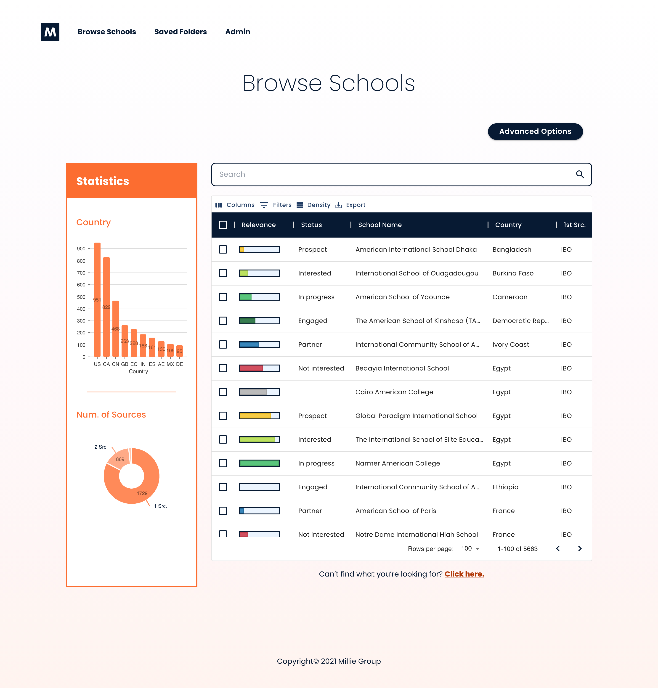
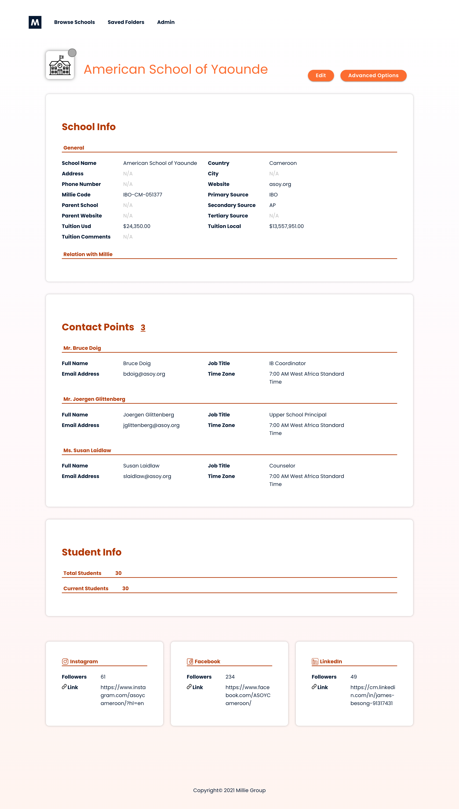

# millie-school-recommender
## Website for Millie's School Recommender Tool

At the time the data in the "Browse" page is retreived from the "mini_master.csv" file in this folder. Eventually I hope this turns into an automated process, where the csv/json is uploaded to AWS and retreived from there. 

## Current iteration includes:
* Home page: 
    * Contains filters to apply to the school search.
    * Quick view of the latest school folders.  (not yet functional)
    
* Browse page: 
    * Displays all schools from the database in a table
    * Table rows may depending on the user's choice in the main page filters. 
    * Includes a search bar to search through the database and return all rows that contain the searched keyword.
    * A statistics bar that shows a summary of the current rows in the table.
    
* School details page: once the user clicks on a row that represenst a specific school in the Browse page, they will be redirected to a page with more details about that school. The page includes general info, contact info, and hyperlinks to any social media links associated with school.

* Folders page (not yet functional):
    * User can select multiple schools from the Browse page, and save them in a folder which would be accessed through this page.
